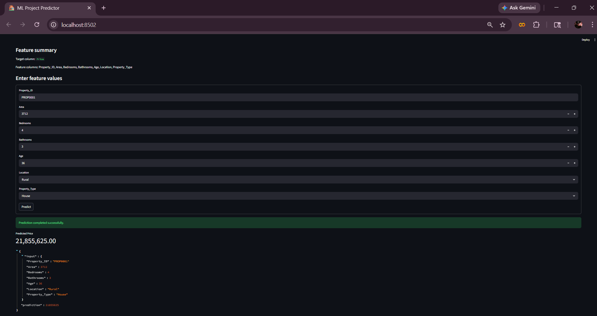

# House Price Prediction — Machine Learning Project

An end-to-end machine learning project for house price estimation, featuring a reusable preprocessing pipeline, automatic model selection, Streamlit UI, and Flask API serving.

## Table of Contents

- [Project Overview](#project-overview)
- [Objectives](#objectives)
- [Technology Stack](#technology-stack)
- [Repository Structure](#repository-structure)
- [Quick Start](#quick-start)
- [Machine Learning Pipeline](#machine-learning-pipeline)
- [API Summary](#api-summary)
- [Screenshots (SS)](#screenshots-ss)
- [Testing](#testing)
- [Documentation Index](#documentation-index)
- [Known Issues and Troubleshooting](#known-issues-and-troubleshooting)
- [Roadmap](#roadmap)

## Project Overview

This repository demonstrates a practical, production-style regression workflow:

- Load and inspect tabular data
- Build robust preprocessing with `ColumnTransformer`
- Train and compare multiple regression models
- Select the best model by evaluation metrics
- Save the full inference pipeline with `joblib`
- Serve predictions through both UI and API interfaces
- Validate core behavior through automated tests

## Objectives

- Build a reproducible house price prediction pipeline.
- Support both human-in-the-loop usage (Streamlit) and system integration (Flask API).
- Keep code modular, testable, and documentation-first.

## Technology Stack

- Python 3.11+
- pandas
- scikit-learn
- joblib
- Streamlit
- Flask
- pytest

## Repository Structure

- `app.py` — Streamlit application for interactive prediction
- `main.py` — training entrypoint with quick EDA output
- `config/config.py` — project constants
- `data/` — input dataset(s)
- `models/` — saved model artifact (`model.pkl`)
- `notebooks/eda.ipynb` — exploratory analysis notebook
- `src/data_preprocessing.py` — preprocessing pipeline construction
- `src/model_training.py` — training, evaluation, and model persistence
- `src/model_inference.py` — model loading and schema-aware prediction
- `src/web_app.py` — Flask API app (`/`, `/health`, `/predict`)
- `tests/test_model.py` — automated tests
- `docs/` — full project documentation set

## Quick Start

1. Create and activate a virtual environment.
2. Install dependencies from `requirements.txt`.
3. Ensure the dataset exists at `data/house_prices (1).csv`.
4. Run training from `main.py` to generate `models/model.pkl`.
5. Start either:
   - Streamlit app (`app.py`), or
   - Flask API (`src/web_app.py`).

## Machine Learning Pipeline

### Data preprocessing

- Numeric features:
  - `SimpleImputer(strategy="mean")`
  - `StandardScaler()`
- Categorical features:
  - `SimpleImputer(strategy="most_frequent")`
  - `OneHotEncoder(handle_unknown="ignore")`

All preprocessing is combined via `ColumnTransformer`.

### Candidate models

- `LinearRegression`
- `RandomForestRegressor`

### Metrics and selection

- MAE
- RMSE
- $R^2$

Best model is selected by minimum RMSE, with $R^2$ as tie-breaker.

## API Summary

- `GET /health` → service status
- `POST /predict` → single-record price prediction from JSON payload

See full API contracts in `docs/open.md`.

## Screenshots (SS)

The project includes a screenshot-ready documentation convention under `docs/screenshots/`.

Expected screenshot files:

- `docs/screenshots/streamlit_prediction_form.png`
- `docs/screenshots/streamlit_prediction_result.png`
- `docs/screenshots/api_response.png`

Embedded preview references:

For capture standards and checklist, see `docs/open.md`.

## Testing

Automated tests currently validate:

- model artifact creation
- numeric prediction output type

Detailed testing notes: `docs/open.md`.

## Documentation Index

- `docs/open.md` (single consolidated documentation file)

## Known Issues and Troubleshooting

- Missing model file:
  - Train first to generate `models/model.pkl`.
- Artifact compatibility problems after dependency upgrades:
  - Retrain and replace the saved model artifact.
- Prediction validation failures:
  - Ensure payload keys match training feature columns.

## Roadmap

- Add CI checks (formatting, lint, tests)
- Add experiment tracking (MLflow)
- Add containerized deployment
- Add model versioning and monitoring

## Project Governance

- Contribution guidelines: `CONTRIBUTING.md`
- Change history: `CHANGELOG.md`
- License: `LICENSE`

## Executive Brief

- Leadership-level summary: `docs/open.md`
